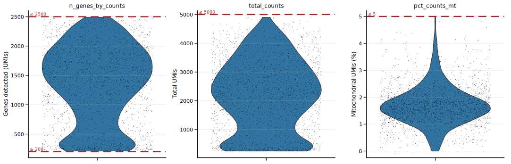
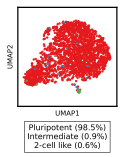

# Refactored QC Workflow

This folder contains a post-internship refactored version of the QC workflow developed during my MSc internship on 4sU-labelled/scNT-seq data from mouse embryonic stem cells (mESCs) (from Qiu et al., 2020).

This workflow serves as the bridge from published processed scNT-seq count matrices toward plots for biological interpretation. Starting from paired new and old RNA gene-by-cell count matrices, it performs QC, cell-state annotation, RNA-stability validation, and exports processed data for downstream variability and burst-kinetics analyses.

## Biological objective

The biological goal of this workflow is to process 4sU/scNT-seq data from mESCs and generate a structured, interpretable representation of the dataset that can support questions about:

- cell-state heterogeneity
- transitions toward a 2-cell-like state
- RNA stability
- downstream transcriptional bursting/noise analyses

## What this workflow implements

This workflow starts from published processed scNT-seq paired new (`C`) and old (`T`) RNA gene-by-cell count matrices and performs the downstream analysis steps needed to generate biologically interpretable outputs.

This includes:

- constructing an `AnnData` object from paired new and old RNA count matrices
- computing quality-control metrics and filtering low-quality cells and low-informative genes
- performing PCA / UMAP / Leiden-based structure analysis
- annotating cells into `Pluripotent`, `Intermediate`, and `2-cell like` states using marker-based scores
- estimating gene-level RNA stability, including half-life, global degradation rate, and global synthesis rate
- measuring 4sud dropout per cell state
- comparing inferred quantities to external reference datasets
- exporting quality-controlled single-cell objects, state-annotated cell populations and processed outputs for downstream analyses

## Workflow overview

### Inputs

The workflow starts from paired gene-by-cell UMI count matrices:

- `C`: newly labeled / new RNA counts
- `T`: pre-existing / old RNA counts

These matrices are used to build a layered `AnnData` object containing:

- `C`
- `T`
- `total`
- `ntr`

### Core analysis steps

1. **Build the base single-cell object**
   - construct `AnnData` from paired new/old RNA matrices

2. **Compute QC metrics**
   - genes detected per cell
   - total UMI counts
   - mitochondrial fraction
   - mean NTR per cell

3. **Apply QC filtering**
   - filter low-quality cells
   - filter low-information genes

4. **Run dimensionality reduction and clustering**
   - normalization
   - log transformation
   - HVG selection
   - PCA
   - neighborhood graph
   - UMAP
   - Leiden clustering

5. **Annotate cell states**
   - score cells using pluripotency and 2-cell-like marker sets
   - define `Pluripotent`, `Intermediate`, and `2-cell like` states

6. **Estimate gene-level RNA stability / turnover quantities**
   - half-life
   - global degradation rate
   - global synthesis rate

7. **Validate against external references**
   - compare estimated half-lives and rates to published reference datasets

8. **Export processed outputs**
   - figures
   - RNA stability / turnover summary tables
   - state-annotated `.h5ad` files
   - matrix exports for downstream variability / burst-kinetics analyses

## Example figure: QC filtering

<p align="center">
  
</p>

This figure summarizes the main quality-control metrics used for filtering, including genes detected, total UMI counts, and mitochondrial fraction. It represents one of the first major processing steps in the workflow and helps document how low-quality cells were excluded before downstream analysis.

## Repository structure

### `run_qc_report.py`
Main entry point for the workflow.  
Runs the full pipeline from loading data to export of figures and processed outputs.

### `config.py`
Central configuration file.  
Defines paths, filenames, marker sets, plotting settings, state labels, and analysis constants.

### `io_utils.py`
Input/output helper functions.  
Loads required files and saves figures, tables, and `.h5ad` outputs with consistent naming.

### `plotting.py`
Plotting helper functions.  
Contains reusable routines for QC figures, UMAP visualizations, validation plots, and diagnostic plots.

### `pipeline.py`
Core analysis logic.  
Contains the main computational steps for QC, dimensionality reduction, annotation, RNA stability / turnover estimation, validation, and export.

## Example figure: cell-state annotation

<p align="center">
  
</p>

This UMAP shows the broad state annotation used in the workflow, separating cells into `Pluripotent`, `Intermediate`, and `2-cell like` populations. These state labels are used later to structure downstream analyses and interpret transcriptional heterogeneity in the mESC population.

## Input files

The workflow expects a `data/` folder at the repository root containing the required input files.

Expected filenames:

- `mESC-WT-rep1_C.txt`
- `mESC-WT-rep1_T.txt`
- `41592_2017_BFnmeth4435_MOESM4_ESM.xls`
- `scNTseq_params.xlsx`
- `GSM4671630_CK-TFEA-run1n2_ds3_gene_exonic.intronic_tagged.dge.txt`

These files are not included in the public repository.

### Provenance

The main mESC input matrices used in this workflow were taken from processed supplementary files associated with the scNT-seq study by Qiu et al. This means the workflow does **not** start from raw FASTQ files, but from published gene-by-cell count matrices that were already generated upstream by the original study.

These processed input matrices still required substantial downstream analysis, including:

- construction of the `AnnData` object
- QC metric calculation
- cell and gene filtering
- dimensionality reduction and clustering
- cell-state annotation
- RNA stability / turnover estimation
- comparison to external reference datasets

Additional local reference files used in the workflow were derived from published studies, including:

- scNT-seq reference material from Qiu et al.
- SLAM-seq supplementary material used for half-life comparison
- processed external reference data used in stability/dropout diagnostics

## Main outputs

The workflow writes results to the configured results directory, for example:

`results/_rep1_fix/`

Outputs include:

- QC violin and scatter plots
- PCA variance plot
- UMAP visualizations
- cell-state annotation outputs
- RNA stability estimates, including half-life, global deg/syn rates
- state-annotated `.h5ad` objects
- per-state matrix exports
- HVG-based exports for downstream analyses

## Example figure: 4sU dropout check

<p align="center">
  
</p>

This diagnostic summarizes how 4sU dropout-related behavior varies across NTR-ranked genes in annotated cell states. This plot was based on the quantification bias paper by Berg et al., 2024.

## How to run

From the repository root:

```bash
python refactored_qc_workflow/run_qc_report.py
